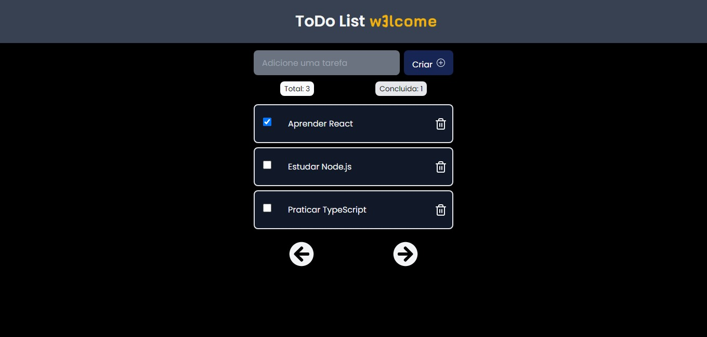

# w3lcome-test

   

   
  

Project made to test of developer fullstack in W3LCOME

    <a href="README.md">English</a>
    ·
    <a href="README-pt.md">Portuguese</a>
 

  ToDo List W3LCOME. Built with ❤︎ by
    <a href="https://github.com/wfTom">wfTom</a>
  

  <a href="#bookmark-about">About</a>&nbsp;&nbsp;&nbsp;|&nbsp;&nbsp;&nbsp;
  <a href="#computer-technologies">Technologies</a>&nbsp;&nbsp;&nbsp;|&nbsp;&nbsp;&nbsp;
  <a href="#rocket-funcionalidades">Features</a>&nbsp;&nbsp;&nbsp;|&nbsp;&nbsp;&nbsp;
  <a href="#construction_worker-how-to-run">How to run</a>&nbsp;&nbsp;&nbsp;|&nbsp;&nbsp;&nbsp;
  <a href="#memo-licença">License</a>

  

  
## :bookmark: About

The **ToDo List W3LCOME** is a Web and Server application of a List of ToDo activities, in this application is possibible create a new task, mark it as completed and delete it, the application also has paging, it also has an optimistic interface for updating and deleting.
The log of all activities was implemented on the server with winston, which contains an info file and an error generated in the root of the server folder with all requests, timestamp and data of requests.
It also has a health check endpoint in http://localhost:3333/healthcheck, generated by the express-healthcheck module.
The swagger was configured to do the api documentation, which has 4 endpoints: 
- GET - to list the tasks, which also has the offset and limit parameters, to perform pagination
- POST - to register a new task
- PATCH - to mark a task as completed
- DELETE - to delete a task.
