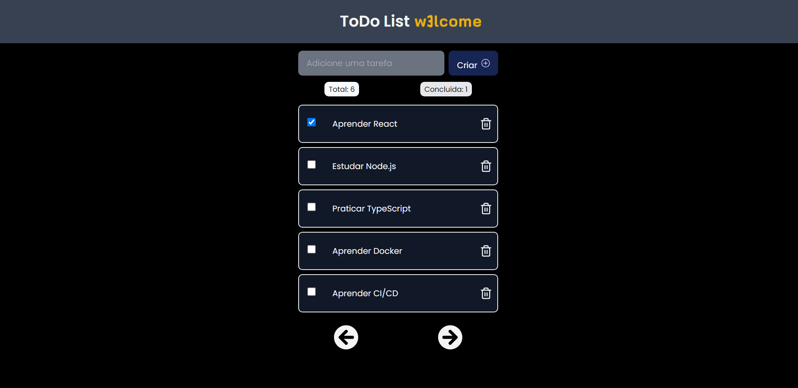
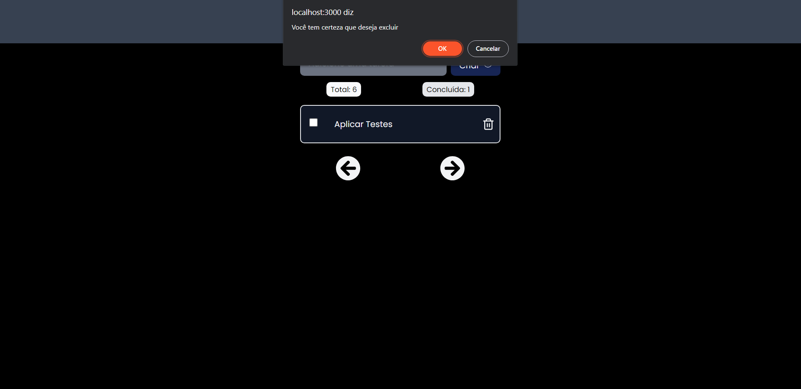

# w3lcome-test

<p align="center">
   
</p>

<p align="center">
   <a href="https://www.linkedin.com/in/wellington-barros-593ba0137/">
      
   </a>
  
</p>

Project made to test the developer's fullstack job at W3LCOME

<p align="center">
    <a href="README.md">English</a>
    ·
    <a href="README-pt.md">Portuguese</a>
 </p>

<div align="center">
  <sub>ToDo List W3LCOME. Built with ❤︎ by
    <a href="https://github.com/wfTom">wfTom</a>
  </sub>
</div>

<p align="center">
   <a href="#bookmark-about">About</a>&nbsp;&nbsp;&nbsp;|&nbsp;&nbsp;&nbsp;
   <a href="#computer-technologies">Technologies</a>&nbsp;&nbsp;&nbsp;|&nbsp;&nbsp;&nbsp;
   <a href="#rocket-funcionalidades">Features</a>&nbsp;&nbsp;&nbsp;|&nbsp;&nbsp;&nbsp;
   <a href="#construction_worker-how-to-run">How to run</a>&nbsp;&nbsp;&nbsp;|&nbsp;&nbsp;&nbsp;
   <a href="#memo-licença">License</a>
</p>

<p align="center">
  
<p>
  
## :bookmark: About

The **ToDo List W3LCOME** is a Web and Server application of a List of ToDo activities, in this application is possibible create a new task, mark it as completed and delete it, the application also has paging, it also has an optimistic interface for updating and deleting.
The log of all activities was implemented on the server with winston, which contains an info file and an error generated in the root of the server folder with all requests, timestamp and data of requests.
It also has a health check endpoint in http://localhost:3333/healthcheck, generated by the express-healthcheck module.
The swagger was configured to do the api documentation, which has 4 endpoints: 
- GET - to list the tasks, which also has the offset and limit parameters, to perform pagination
- POST - to register a new task
- PATCH - to mark a task as completed
- DELETE - to delete a task.

### Web Screenshot

<div>
   
   
</div>
<div>
   
   
</div>

# :computer: Technologies

This project was made using the follow technologies:

- [Typescript](https://www.typescriptlang.org/)
- [Node.js](https://nodejs.org/en/)
- [Express](https://expressjs.com/)
- [Axios](https://github.com/axios/axios)
- [ReactJS](https://reactjs.org/)

# :rocket: Features

- ToDo list.
- Add and Remove activities.
- Pagination.
- Mark as complete.

- ### **Requirements**

  - It is **necessary** to have **[Node.js](https://nodejs.org/en/)** installed
    on the computer.
  - It is **optional** to have **[Git](https://git-scm.com/)** installed and
    configured on the computer, but it is better to have.
  - Also, it is **necessary** to have a package manager be the
    **[NPM](https://www.npmjs.com/)** or **[Yarn](https://yarnpkg.com/)**.

```bash
# Clone Repository
$ git clone https://github.com/wfTom/w3lcome-test.git
```

### 📦 Run API

```bash
# Go to server folder
$ cd w3lcome-test/server

# Install Dependencies
$ yarn install

# Run Application
$ yarn dev
```

Access API at http://localhost:3333/

### 💻 Run Web Project

```bash
# Go to web folder
$ cd w3lcome-test/client

# Install Dependencies
$ yarn install

# Run Application
$ yarn dev
```

Go to http://localhost:3000/ to see the result.

# :closed_book: License

Released in 2021 :closed_book: License

Made with love by [wfTom](https://github.com/wfTom) 🚀. This project is under
the [MIT license](./LICENSE).

Give a ⭐️ if this project helped you!
